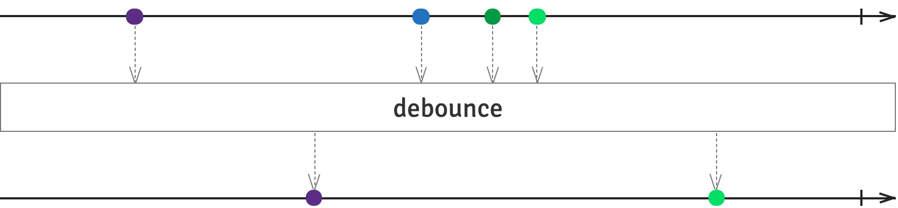
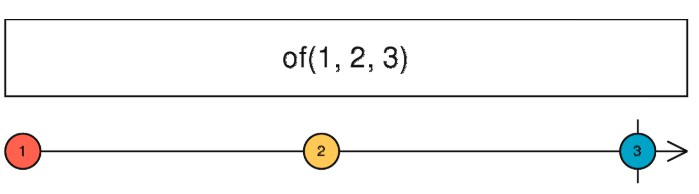
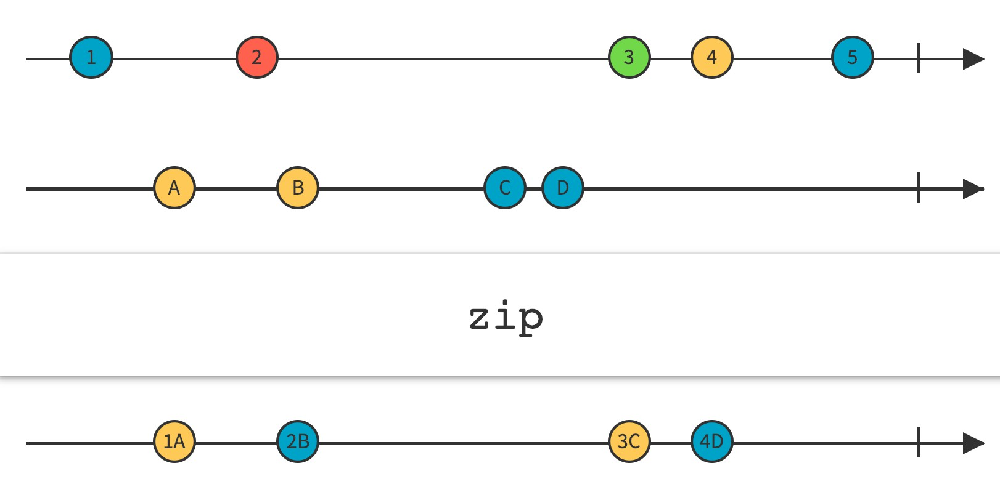
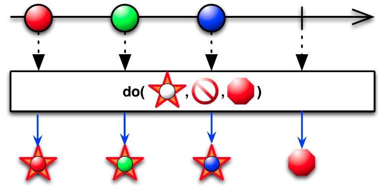
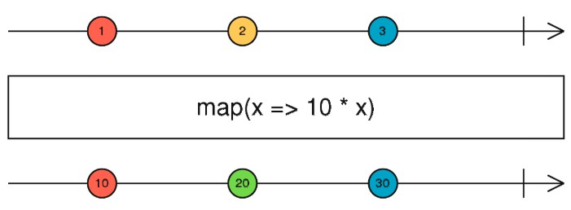
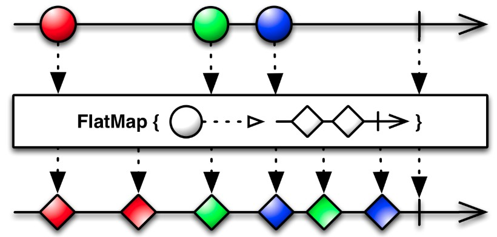
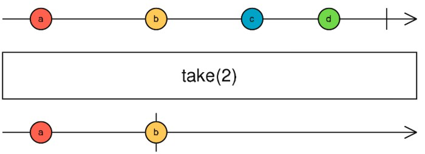
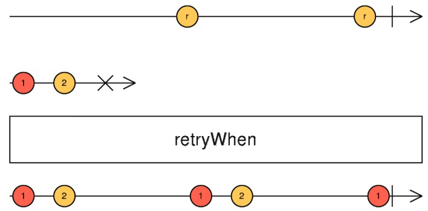
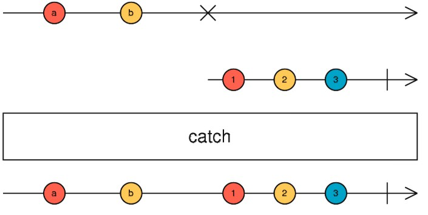

## RxJs Quick Guide

### What is ReactiveX

<b>ReactiveX is a combination of the best ideas from
the Observer pattern, the Iterator pattern, and functional programming
</b>



<i><b>ReactiveX is more than an API, it's an idea and a breakthrough in programming. It has inspired several other APIs, frameworks, and even programming languages.</b></i>

### 3 main procedures for Observable
1. <b>Create</b> -- Create event steam or data steam.
2. <b>Combine</b> -- Compose and tranform steams with query-like operators.
3. <b>Listen</b> -- Subscribe to any observable stream to perform side effects.

### Why we use ReactiveX?

* <b>Number of event can be handled</b> -- Promise handles a single evnet when an async operation completes or fails. An <b>Observable</b> is like a <b>stream</b> (in many languages) and allows to pass 0 or more events where the callback call for each event.<br/>
<i>Note: Although you can use Promise.all to handle multiple event in one time, but it will be likely bring you into the callback hell.</i>

* <b>Operators or features</b> -- Observable provides the features of Promise and more. We can utilize the same API in each case.

* <b>Cancelable</b> -- If the result of an HTTP request to a server ot some other expensive async operation isn't needed anymore, the <b>Subscription</b> of an Observable allows to cancel the subscription, while a Promise will eventually call teh success or failed callback even when you don't need the notification or the reault it provides anymore.<br/>
<i>Note: There are Promise libraries out there that support cancellation, but ES6 Promise doesn't so far.</i>

### Basic concepts

* <b>Observable</b> -- Observable is an object which will be subscribed by an observer. The observer reacts to whatever item or sequence of items the observable emits. The observable is ready for emitting when being created.

* <b>Chaining Operators</b> -- The methods to check or change the observables. Most operators operates on an observable and return an observable. It allows you to apply these operators one after one, in a chain. Each operator in the chain modifies the observable from the return of previous operator.

* <b>Subscribe and Observer</b> -- The observable will emit it content when it is subscribed. And the observer do its job at this time.

### Commonly use Rx operators in our project

#### Creation

* <b>of</b> -- Conver various other objects and data types into Observable. (the same as "from")<br/>
<i>When you work with Observables, it can be more convenient if all of the data you mean to work with can be represented as Observables, rather than as a mixture of Observables and other types. This allows you to use a single set of operators to govern the entire lifespan of the data stream.<br/>Iterables, for example, can be thought of as a sort of synchronous Observable; Futures, as a sort of Observable that always emits only a single item. By explicitly converting such objects to Observables, you allow them to interact as peers with other Observables.<br/>For this reason, most ReactiveX implementations have methods that allow you to convert certain language-specific objects and data structures into Observables.</i><br/>
<br/>
```javascript
let numbers = Rx.Observable.of(10, 20, 30);
let letters = Rx.Observable.of('a', 'b', 'c');
let interval = Rx.Observable.interval(1000);
let result = numbers.concat(letters).concat(interval);
result.subscribe(x => console.log(x));
```

* <b>zip</b> -- Combine the emissions of multiple Observables together via a specified function and emit single items for each combination based on the results of this function<br/>
<i>The Zip method returns an Observable that applies a function of your choosing to the combination of items emitted, in sequence, by two (or more) other Observables, with the results of this function becoming the items emitted by the returned Observable. It applies this function in strict sequence, so the first item emitted by the new Observable will be the result of the function applied to the first item emitted by Observable #1 and the first item emitted by Observable #2; the second item emitted by the new zip-Observable will be the result of the function applied to the second item emitted by Observable #1 and the second item emitted by Observable #2; and so forth. It will only emit as many items as the number of items emitted by the source Observable that emits the fewest items.</i><br/>

```javascript
let age$ = Observable.of<number>(27, 25, 29);
let name$ = Observable.of<string>('Foo', 'Bar', 'Beer');
let isDev$ = Observable.of<boolean>(true, true, false);

Observable
    .zip(age$,
         name$,
         isDev$,
         (age: number, name: string, isDev: boolean) => ({ age, name, isDev }))
    .subscribe(x => console.log(x));

// Output：
// { age: 27, name: 'Foo', isDev: true }
// { age: 25, name: 'Bar', isDev: true }
// { age: 29, name: 'Beer', isDev: false }
```

* <b>fromPromise</b> -- Convert promise objects and data types into Observables<br/>
<i>When you work with Observables, it can be more convenient if all of the data you mean to work with can be represented as Observables, rather than as a mixture of Observables and other types. This allows you to use a single set of operators to govern the entire lifespan of the data stream.<br/>
Note: The promise will start to do its job when you create it, instead of subscribing the obervable!!!</i>
```javascript
let result = Rx.Observable.fromPromise(fetch('http://myserver.com/'));
result.subscribe(x => console.log(x), e => console.error(e));
```

* <b>bindNodeCallback</b> -- Converts a Node.js-style callback API to a function that returns an Observable.<br/>
<i>bindNodeCallback is not an operator because its input and output are not Observables. The input is a function func with some parameters, but the last parameter must be a callback function that func calls when it is done. The callback function is expected to follow Node.js conventions, where the first argument to the callback is an error object, signaling whether call was successful. If that object is passed to callback, it means something went wrong.<br/>The output of bindNodeCallback is a function that takes the same parameters as func, except the last one (the callback). When the output function is called with arguments, it will return an Observable. If func calls its callback with error parameter present, Observable will error with that value as well. If error parameter is not passed, Observable will emit second parameter. If there are more parameters (third and so on), Observable will emit an array with all arguments, except first error argument.<br/>Optionally bindNodeCallback accepts selector function, which allows you to make resulting Observable emit value computed by selector, instead of regular callback arguments. It works similarly to bindCallback selector, but Node.js-style error argument will never be passed to that function.</i>

```javascript
// Read a file from the filesystem and get the data as an Observable
import * as fs from 'fs';
let readFileAsObservable = Rx.Observable.bindNodeCallback(fs.readFile);
let result = readFileAsObservable('./roadNames.txt', 'utf8');
result.subscribe(x => console.log(x), e => console.error(e));
```

#### Flow operators

* <b>do</b> -- Register an action to take upon a variety of Observable lifecycle events.<br/>

```javascript
/* Using a function */
let source = Rx.Observable.range(0, 3)
  .do(
    function (x)   { console.log('Do Next:', x); },
    function (err) { console.log('Do Error:', err); },
    function ()    { console.log('Do Completed'); }
  );

let subscription = source.subscribe(
  function (x) { console.log('Next: %s', x); },
  function (err) { console.log('Error: %s', err); },
  function () { console.log('Completed'); });
```

* <b>map</b> -- Transform the items emitted by an Observable by applying a function to each item.<br/>
<i>The Map operator applies a function of your choosing to each item emitted by the source Observable, and returns an Observable that emits the results of these function applications.</i><br/>


```javascript
// Map every click to the clientX position of that click
let clicks = Rx.Observable.fromEvent(document, 'click');
let positions = clicks.map(ev => ev.clientX);
positions.subscribe(x => console.log(x));
```

* <b>flatMap</b> -- Transform the items emitted by an Observable into Observables, then flatten the emissions from those into a single Observable.<br/>
<i>The FlatMap operator transforms an Observable by applying a function that you specify to each item emitted by the source Observable, where that function returns an Observable that itself emits items. FlatMap then merges the emissions of these resulting Observables, emitting these merged results as its own sequence.</i><br/>
<i><b>Note: </b>FlatMap merges the emissions of these Observables, so that they may interleave.</i><br/>

```javascript
// Map and flatten each letter to an Observable ticking every 1 second
let letters = Rx.Observable.of('a', 'b', 'c');
let result = letters.flatMap(x =>
  Rx.Observable.interval(1000).map(i => x+i)
);
result.subscribe(x => console.log(x));

// Results in the following:
// a0
// b0
// c0
// a1
// b1
// c1
// continues to list a,b,c with respective ascending integers
```

* <b>take</b> -- Emits only the first count values emitted by the source Observable.<br/>
<i>"take" returns an Observable that emits only the first count values emitted by the source Observable. If the source emits fewer than count values then all of its values are emitted. After that, it completes, regardless if the source completes.</i>

```javascript
// Take the first 5 seconds of an infinite 1-second interval Observable
let interval = Rx.Observable.interval(1000);
let five = interval.take(5);
five.subscribe(x => console.log(x));
```

* <b>retryWhen</b> -- If a source Observable emits an error, resubscribe to it in the hopes that it will complete without error.<br/>
<i>The Retry operator responds to an onError notification from the source Observable by not passing that call through to its observers, but instead by resubscribing to the source Observable and giving it another opportunity to complete its sequence without error. Retry always passes onNext notifications through to its observers, even from sequences that terminate with an error, so this can cause duplicate emissions (as shown in the diagram above).</i>

```javascript
http.get( url,options )
    .retryWhen(( errors ) => {
        return errors
            .mergeMap((error) => (error.status === 429) ? Observable.throw(error) : Observable.of(error))
            .delay(1000)
            .take(2);
    })
    .catch((res) => throw res);
```

* <b>catch</b> -- Catches errors on the observable to be handled by returning a new observable or throwing an error.<br/>
<i>The Catch operator intercepts an onError notification from the source Observable and, instead of passing it through to any observers, replaces it with some other item or sequence of items, potentially allowing the resulting Observable to terminate normally or not to terminate at all.</i>

```javascript
// Continues with a different Observable when there's an error
Observable.of(1, 2, 3, 4, 5)
  .map(n => {
	   if (n == 4) {
	     throw 'four!';
    }
   return n;
  })
  .catch(err => Observable.of('I', 'II', 'III', 'IV', 'V'))
  .subscribe(x => console.log(x));
  // 1, 2, 3, I, II, III, IV, V
```

#### Cancelation

* <b>subscirption.unsubscribe()</b> -- "Subscription" represents a disposable resource, such as the execution of an Observable. A Subscription has one important method, unsubscribe, that takes no argument and just disposes the resource held by the subscription.